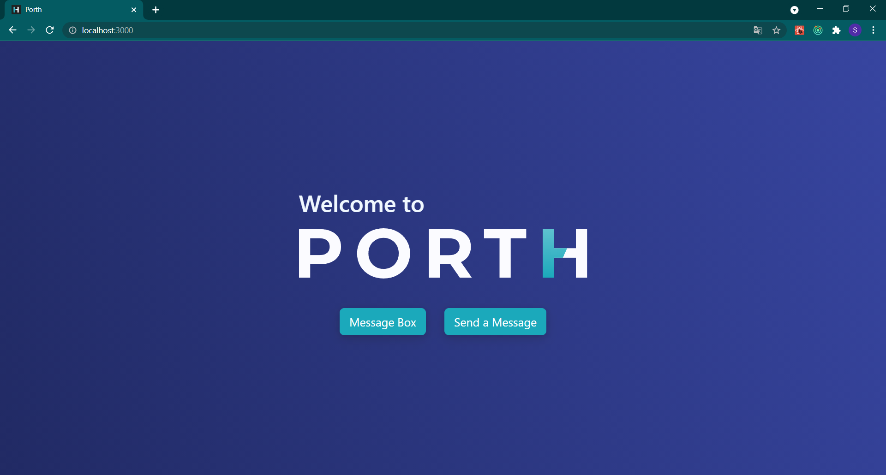
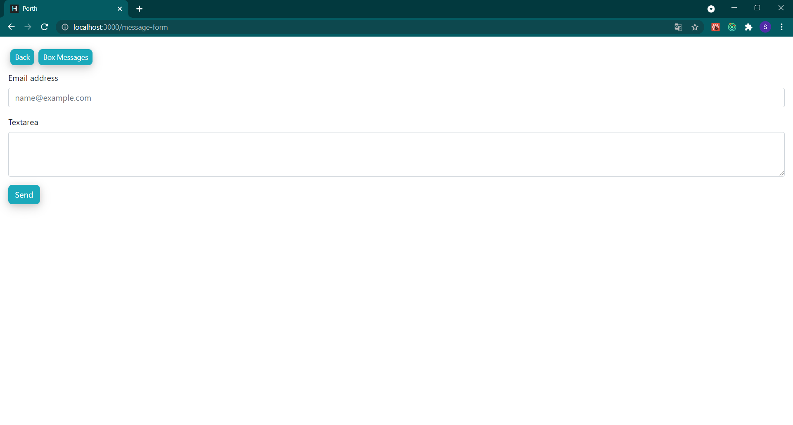
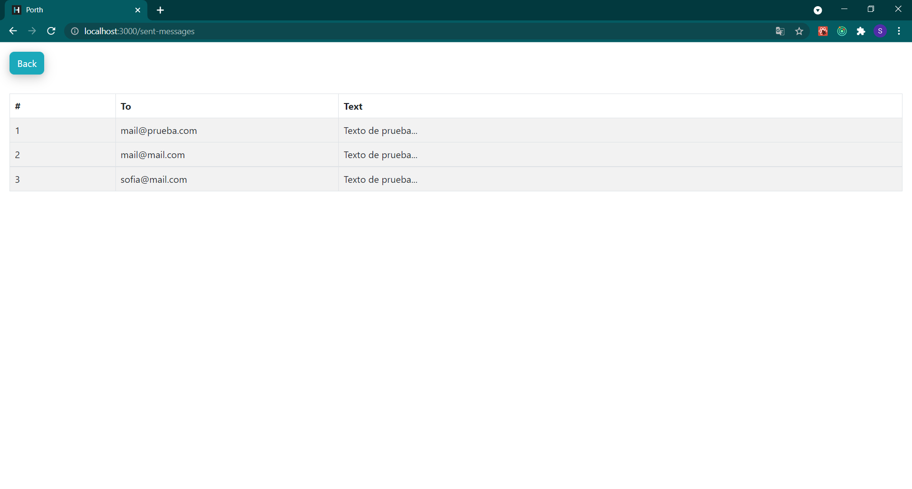

<h2>🔹 Message Box</h2

Functionalities:
- Create messages
- View all sent messages
  

🔹 Technologies used: NodeJS- ReactJS-  React-Bootstrap- JavaScript 

<h3>Home<h3>
  
  
<h3>Form</h3>

  
    
<h3>Messages Box</h3>

  

##  Run the next command lines to getting started 💻

First you'll have to clone this repository in a folder in your computer, then you'll have to open your console in that directory and: 
  
  
npm install

  
npm run serve

This will start the app on your  http://localhost:8080/
